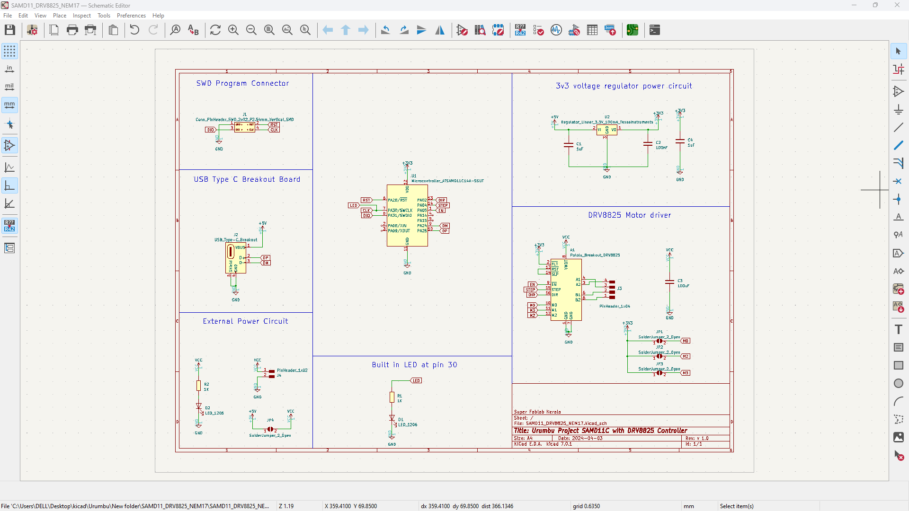
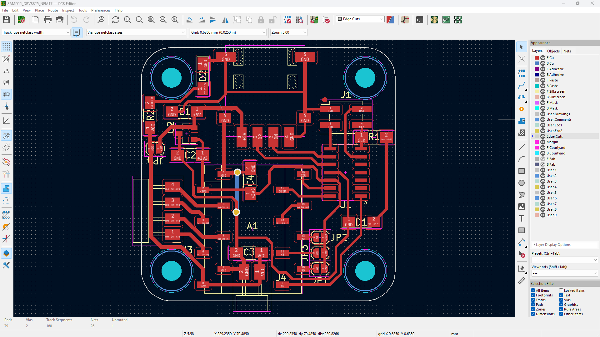
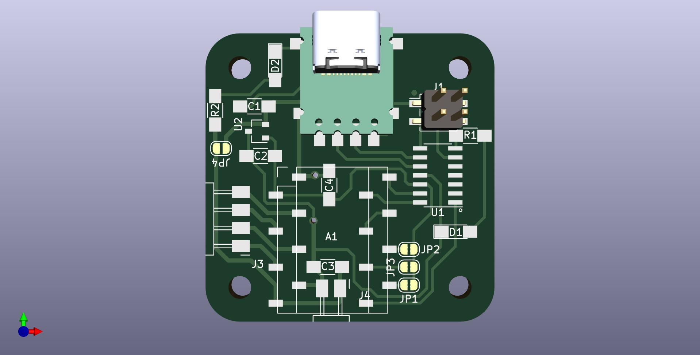
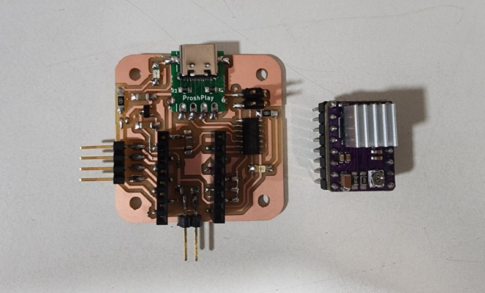
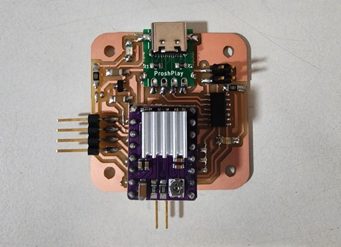

# Urumbu_Project-SMD11C_DRV8825

I wanted to try out the Urumbu Project by Neil Gershenfeld, at SuperFablab Kerala, Kochi but, unfortunately, we don't have a 5V stepper driver in our inventory, so thought of creating a version of the Urumbu project with SAMD11C and DRV8825 motor driver.

## Design

## Testing

<video controls src="media/Test.mp4" title="Title"></video>

## Downloads
- [SAMD11_DRV8825_NEM17.pdf](<design files/Kicad Files/SAMD11_DRV8825_NEM17.pdf>)
- [SAMD11_DRV8825_NEM17.step](<design files/Kicad Files/SAMD11_DRV8825_NEM17.step>)
- [gerber.zip](<design files/Gerber Files/gerber.zip>)
- [Firmware](firmware/urumbu-d11c-drv8825/urumbu-d11c-drv8825.ino)